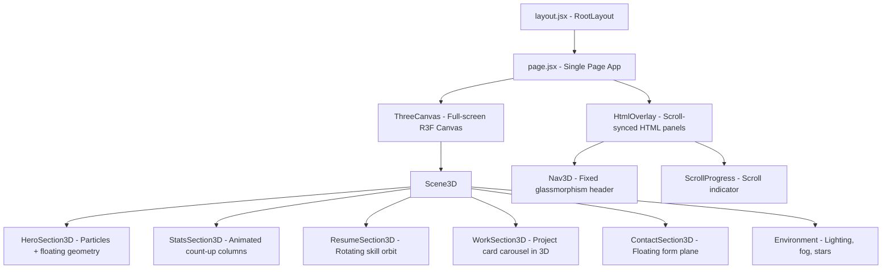

# Convert Portfolio to Immersive 3D Website

Transform the existing multi-page Next.js portfolio into a single-page, scroll-driven 3D experience using **React Three Fiber (R3F)** + **Three.js** + **@react-three/drei**, while preserving every piece of data, content, link, and functionality.

## User Review Required

> [!IMPORTANT]
> **Single-page vs Multi-page architecture:** The plan converts all current routes (`/`, `/resume`, `/work`, `/contact`) into scroll-based 3D sections on a single page. The old Next.js routes will be removed. Navigation will scroll to 3D sections instead of navigating to separate pages. **Is this acceptable, or do you want to keep separate routes that each have their own 3D scene?**

> [!IMPORTANT]
> **Performance budget:** A full 3D scene with particles, animated geometries, and multiple sections will be GPU-intensive. The plan uses lightweight geometries (no heavy GLTF models), instanced meshes, and lazy loading to keep it performant. On low-end devices, we'll implement a quality fallback. **Are you targeting desktop-only, or must mobile perform well too?**

> [!WARNING]
> **Contact form & API route preserved.** The existing `/api/send-email` route and nodemailer integration will remain completely untouched. The form will simply render as an HTML overlay on top of the 3D canvas.

## Open Questions

1. **Profile photo in 3D:** Should your photo remain as-is (2D image overlaid on the 3D scene), or would you like it mapped onto a 3D geometry (e.g., a floating sphere/plane)?
2. **Color theme:** Current accent is `#00ff99` (neon green) on `#1c1c22` dark background. This pairs well with 3D. Keeping it as-is — confirm?
3. **Services page:** Currently stub/incomplete (just renders the word "services" in a div). Should it be included in the 3D version, or remain excluded (it's already commented out of navigation)?

---

## Architecture Overview



---

## Proposed Changes

### New Dependencies

```
npm install @react-three/fiber @react-three/drei three @types/three maath
```

- **@react-three/fiber** — React renderer for Three.js
- **@react-three/drei** — Helpers (Text3D, Float, Stars, ScrollControls, Html, etc.)
- **three** — Core 3D engine
- **maath** — Math utilities for smooth animations

Existing dependencies (framer-motion, tailwind, radix, swiper, etc.) will remain — some are still used for the HTML overlay layer and the contact form.

---

### Data Layer

#### [NEW] [data/portfolio.js](file:///d:/Programming/portfolio-next-js/src/data/portfolio.js)

Extract **all** hardcoded data from the existing components into a single centralized data file. This includes:
- Personal info (name, role, bio, phone, email, address, skype, nationality, languages)
- Social links (GitHub, LinkedIn, WhatsApp, Twitter)
- Stats (1600 hours, 16 projects, 15 technologies, 1100 commits)
- Education history (4 entries)
- Skills list (22 skills with names — icons will be mapped separately in the component)
- Services (3 entries)
- Projects (5 entries with full descriptions, stacks, features, technical highlights, links)
- Contact info (phone, email, address)
- CV/Resume download URLs
- Navigation links

This is the **exact same data** that currently lives scattered across `Text.jsx`, `Stats.jsx`, `Social.jsx`, `Header.jsx`, `MobileNav.jsx`, `Footer.jsx`, `resume/page.jsx`, `services/page.jsx`, `work/page.jsx`, and `contact/page.jsx`.

---

### 3D Core Infrastructure

#### [NEW] [components/3d/ThreeCanvas.jsx](file:///d:/Programming/portfolio-next-js/src/components/3d/ThreeCanvas.jsx)

The root R3F `<Canvas>` wrapper:
- Full-viewport canvas with `ScrollControls` from drei (pages={5} — one per section)
- Sets up camera, lighting, tone mapping
- Renders `<Scene3D>` inside scroll controls
- Renders HTML overlay elements outside the canvas

#### [NEW] [components/3d/Scene3D.jsx](file:///d:/Programming/portfolio-next-js/src/components/3d/Scene3D.jsx)

Master scene component that composes all 3D sections at different scroll offsets:
- `<Environment>` for ambient lighting
- `<Stars>` background from drei
- `<Float>` decorative geometries
- Each section component positioned at its scroll offset

---

### Section Components (3D)

#### [NEW] [components/3d/HeroSection3D.jsx](file:///d:/Programming/portfolio-next-js/src/components/3d/HeroSection3D.jsx)

**Replaces:** `page.jsx` + `Text.jsx` + `Photo.jsx`

- Animated particle field background (using drei `<Points>` with instanced buffer geometry)
- Profile photo on a floating `<Plane>` with `<Image>` texture from drei, gentle `<Float>` animation
- Animated SVG circle effect recreated as a `<Ring>` geometry with custom shader for the dashed-stroke animation
- Name, role, bio rendered via drei `<Html>` component (preserving exact text content and download buttons)
- Social links rendered as HTML overlay
- **All data sourced from `portfolio.js`**

#### [NEW] [components/3d/StatsSection3D.jsx](file:///d:/Programming/portfolio-next-js/src/components/3d/StatsSection3D.jsx)

**Replaces:** `Stats.jsx`

- Four 3D bar/column geometries that grow upward as you scroll into view
- `<Html>` labels on each bar showing the `CountUp` animated numbers
- Retains `react-countup` for the number animation, triggered by scroll visibility
- Glowing accent-colored (`#00ff99`) emissive material on the bars
- **Same 4 stats: 1600 hours, 16 projects, 15 technologies, 1100 commits**

#### [NEW] [components/3d/ResumeSection3D.jsx](file:///d:/Programming/portfolio-next-js/src/components/3d/ResumeSection3D.jsx)

**Replaces:** `resume/page.jsx`

- **Skills orbit:** 22 skill icons rendered as textured planes orbiting in a 3D ring/sphere. Each plane shows the skill icon. Hovering pauses rotation and shows skill name tooltip.
- **Education timeline:** Vertical timeline rendered with `<Html>` panels floating in 3D space, each card showing institution, degree, and duration — same data as current education cards.
- **About me:** Info grid rendered as a glassmorphic `<Html>` panel in 3D space.
- Tab switching (Skills/Education/About) via `<Html>` buttons that animate the camera or swap visible 3D groups.

#### [NEW] [components/3d/WorkSection3D.jsx](file:///d:/Programming/portfolio-next-js/src/components/3d/WorkSection3D.jsx)

**Replaces:** `work/page.jsx` + `LivePreviewModal.jsx`

- **3D project carousel:** Each project rendered as a floating card plane with its screenshot/iframe as a texture. Cards arranged in a circular carousel in 3D space.
- Clicking a card zooms camera to it and reveals the full project details panel (title, description, stack, features, technical highlights) via `<Html>`.
- GitHub/Live/Preview action buttons rendered as HTML overlaid on the 3D card.
- Swipe or arrow key navigation rotates the carousel.
- **All 5 projects preserved with identical data.**

#### [NEW] [components/3d/ContactSection3D.jsx](file:///d:/Programming/portfolio-next-js/src/components/3d/ContactSection3D.jsx)

**Replaces:** `contact/page.jsx` + `Form.jsx`

- Background: animated low-poly terrain or wave mesh with accent-colored wireframe.
- Contact form rendered as `<Html>` inside a floating panel in 3D space — **exact same form** with name, email, message fields, same `sendEmail` function hitting `/api/send-email`.
- Contact info (phone, email, address) displayed as `<Html>` elements with icon indicators.
- "Let's work together" heading and description text preserved exactly.

---

### Navigation & Transitions

#### [NEW] [components/3d/Nav3D.jsx](file:///d:/Programming/portfolio-next-js/src/components/3d/Nav3D.jsx)

**Replaces:** `Header.jsx` + `MobileNav.jsx`

- Fixed-position glassmorphism navigation bar (rendered as HTML, not in the 3D scene)
- Same links: Home, Resume, Work, Contact — clicking scrolls to the corresponding 3D section
- "Abu Horaira." logo with accent dot
- "Hire Me" button → scrolls to Contact section
- Mobile hamburger menu with the same links
- Active section highlighted based on scroll position

#### [DELETE] [PageTransition.jsx](file:///d:/Programming/portfolio-next-js/src/components/PageTransition.jsx)
#### [DELETE] [StairTransition.jsx](file:///d:/Programming/portfolio-next-js/src/components/StairTransition.jsx)
#### [DELETE] [Stairs.jsx](file:///d:/Programming/portfolio-next-js/src/components/Stairs.jsx)

Page transitions are no longer needed — the site is now a single-page scroll experience. Section transitions happen via scroll-driven 3D camera movement.

---

### Pages & Routes

#### [MODIFY] [page.jsx](file:///d:/Programming/portfolio-next-js/src/app/page.jsx)

Becomes the sole page. Renders:
```jsx
<ThreeCanvas />  // Full 3D experience with all sections
```

#### [MODIFY] [layout.jsx](file:///d:/Programming/portfolio-next-js/src/app/layout.jsx)

- Remove `<StairTransition>` and `<PageTransition>` wrappers
- Remove `<Header>` (replaced by `<Nav3D>` inside `ThreeCanvas`)
- Keep SEO metadata, structured data, font, analytics, speed insights
- Keep favicon links

#### [DELETE] [resume/page.jsx](file:///d:/Programming/portfolio-next-js/src/app/resume/page.jsx)
#### [DELETE] [services/page.jsx](file:///d:/Programming/portfolio-next-js/src/app/services/page.jsx)
#### [DELETE] [work/page.jsx](file:///d:/Programming/portfolio-next-js/src/app/work/page.jsx)
#### [DELETE] [contact/page.jsx](file:///d:/Programming/portfolio-next-js/src/app/contact/page.jsx)

All content from these pages is now rendered as 3D sections in the single page. The actual data is preserved in `data/portfolio.js`.

#### [KEEP] [api/send-email/route.js](file:///d:/Programming/portfolio-next-js/src/app/api/send-email/route.js)

**No changes.** Email API works exactly as before.

---

### Styling

#### [MODIFY] [globals.css](file:///d:/Programming/portfolio-next-js/src/app/globals.css)

Add:
- `html, body { height: 100%; overflow: hidden; }` — the R3F ScrollControls handles scrolling
- Canvas sizing styles
- Glassmorphism utility classes for the nav
- Keep existing base styles (`.h1`, `.h2`, `.h3`, text-outline)

#### [KEEP] [tailwind.config.js](file:///d:/Programming/portfolio-next-js/tailwind.config.js)

No changes needed. Colors, fonts, and breakpoints remain the same.

---

### Components Retained (with minor modifications)

| Component | Status | Notes |
|-----------|--------|-------|
| `Form.jsx` | **KEEP** | Used inside `ContactSection3D` as-is |
| `Social.jsx` | **KEEP** | Used in `HeroSection3D` HTML overlay |
| `Footer.jsx` | **MODIFY** | Render at bottom of scroll as HTML overlay |
| `ui/button.jsx` | **KEEP** | Used in form and nav |
| `ui/tooltip.jsx` | **KEEP** | Used for skill hover |
| `ui/scroll-area.jsx` | **KEEP** | May be used for project details scroll |
| `ui/sheet.jsx` | **KEEP** | Used for mobile nav |
| Other UI components | **KEEP** | No changes |

### Components Removed

| Component | Reason |
|-----------|--------|
| `Header.jsx` | Replaced by `Nav3D.jsx` |
| `MobileNav.jsx` | Merged into `Nav3D.jsx` |
| `Photo.jsx` | Replaced by 3D floating photo in `HeroSection3D` |
| `Text.jsx` | Replaced by HTML in `HeroSection3D` |
| `Stats.jsx` | Replaced by `StatsSection3D` |
| `PageTransition.jsx` | No page transitions in SPA |
| `StairTransition.jsx` | No page transitions in SPA |
| `Stairs.jsx` | No page transitions in SPA |
| `LivePreviewModal.jsx` | Integrated into `WorkSection3D` |
| `ui/WorkSliderBtns.jsx` | Replaced by 3D carousel navigation |

---

### Summary of New Files

```
src/
├── data/
│   └── portfolio.js          # Centralized data (all content extracted)
├── components/
│   └── 3d/
│       ├── ThreeCanvas.jsx    # Root canvas + scroll controls
│       ├── Scene3D.jsx        # Master scene composition
│       ├── HeroSection3D.jsx  # Hero: particles, photo, intro text
│       ├── StatsSection3D.jsx # Animated stat columns
│       ├── ResumeSection3D.jsx# Skills orbit, education timeline, about
│       ├── WorkSection3D.jsx  # 3D project carousel
│       ├── ContactSection3D.jsx # Contact form + floating panel
│       └── Nav3D.jsx          # Fixed 3D-styled navigation
```

---

## Verification Plan

### Automated Tests
```bash
npm run build     # Ensure no build errors
npm run lint      # Ensure no lint issues
```

### Manual Verification
1. **Data integrity check:** Compare every text string, link, number, and data point in the 3D version against the original site to confirm nothing is missing or altered.
2. **Scroll navigation:** Verify clicking each nav link scrolls to the correct 3D section.
3. **Contact form:** Submit a test email and verify it's received (same `/api/send-email` route).
4. **Download buttons:** Verify Resume and CV download buttons work.
5. **Social links:** All 4 social links open correct URLs.
6. **Project links:** All 5 projects' live, GitHub client, and GitHub server links work.
7. **Mobile responsiveness:** Test on mobile viewport — nav hamburger menu works, 3D scene degrades gracefully.
8. **Performance:** Check FPS in dev tools — target 60fps on desktop, 30fps on mobile.
9. **SEO:** Verify structured data, meta tags, and og tags still render in page source.
